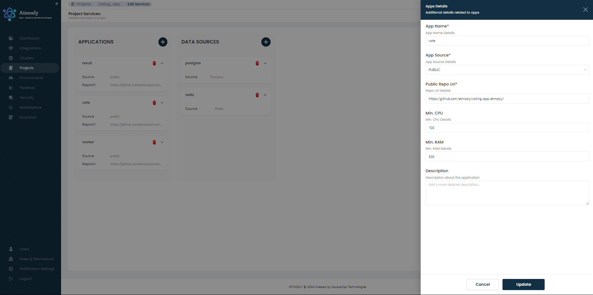
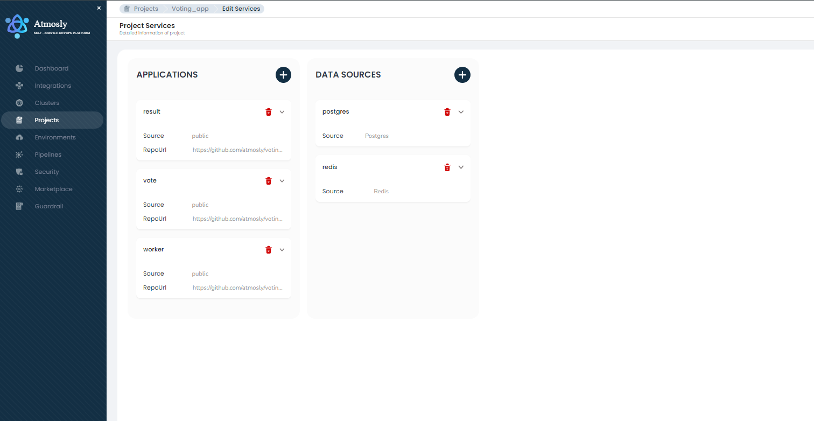
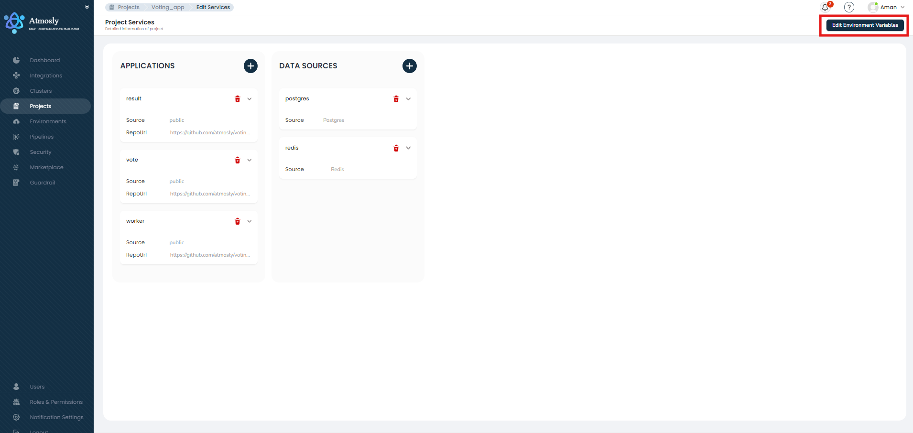
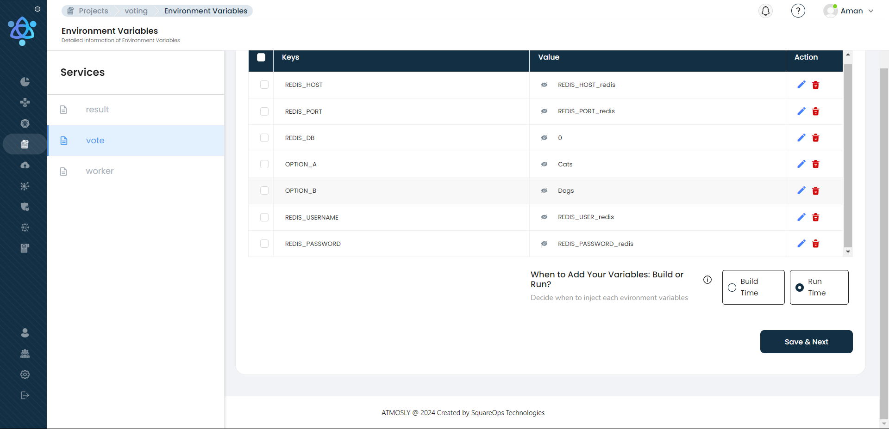
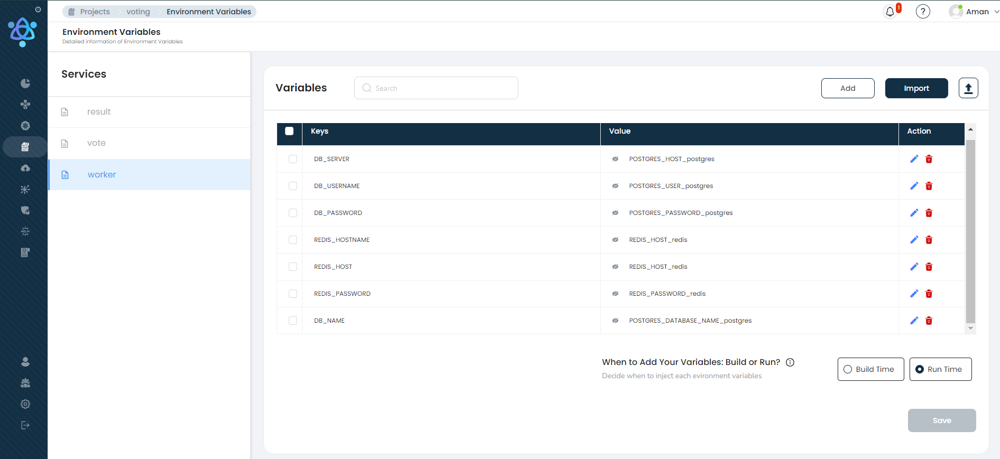
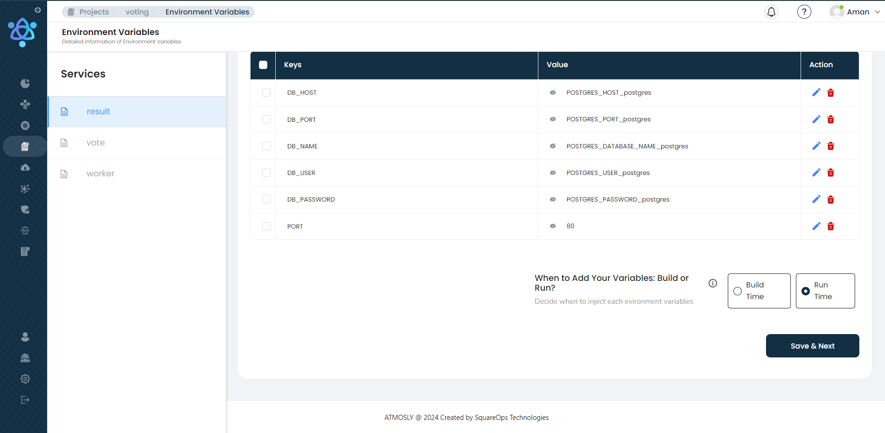

# Deploying Voting App with Atmosly 

 Welcome to the Atmosly deployment guide! This README will walk you through the steps to deploy Voting app on our platform.
 
Before we begin: 
1. [Here](https://docs-test.atmosly.com/docs/atmosly/what_is_atmosly) is a quick introduction of Atmosly.
2. [Here](https://docs-test.atmosly.com/docs/atmosly/before_you) is where you can learn about common terminologies that we will be using throughout this document.

Through this document, we will be deploying Voting application on Atmosly. [Listed here](https://docs-test.atmosly.com/docs/atmosly/deploy_your_first_application) is a brief of all the steps we will be following to successfully deploy the application. 
 

## About the Voting App

GitHub URL - https://github.com/dockersamples/example-voting-app. 

This application consists of five microservices -
 - Vote (python) - from where end user would cast a vote
 - Result (react) - where the results of the voting are stored 
 - Worker (dot net)
 - Postgresql
 - Redis

 ## Prerequisites
- An account on [Atmosly](https://app.atmosly.com/signup) 
Follow the steps here to sign up on Atmosly.

- A cloud account integrated   Follow the steps [here](https://docs-test.atmosly.com/docs/general/Integrations) to integrate your AWS account.
> PLEASE NOTE: we only have support of AWS on the platform right now.

- A cluster ready on Atmosly
Follow the steps [here](https://docs-test.atmosly.com/docs/clusters/create_cluster) to create a cluster on Atmosly.  

## Setup
We have an open source project available for the Voting App. 

Under "Projects" module, you will see a folder with the name of Voting App: 
  

### What are Projects:
Projects is an application blueprint on Atmosly where we define basic details for an application.  
Projects module have three elements:
1. Applicaton services
2. DataSource services
3. Environment Variables   

You can find more details about the Project module [here](https://docs-test.atmosly.com/docs/projects/create_project). 

### To make a new project: 
#### Step 1: 
For the application services, you will need to click on the "+" icon in Applications and add Vote microservice as per screenshot below. 

Adding Vote Microservice:

For all other application microservices, i.e. Result and Worker, follow the similat structure as with the Vote microservice. Repo would be considered service's repo. 

#### Step 2: 
For the database, you will need to click on the "+" icon in Data Sources and add PostgreSQL and Redis individually.  

  
Once you have added both application and datasource services, it would look like this:  

Now, to manage dependency in between applications, you can use environment variables to tell the, for example, Website Service where to find the Database Service. 

#### Step 3: 

a. Click on the **Edit Environment Variable** button. 

  

You have two choices for adding environment variables:
1. Importing/ selecting the .env file from GitHub branch - by clicking on the **Import** button.
2. Manually adding it by clicking the **Add** button

  When you access the project, you will see the environment variables already in place, however, if you would like to access the .env file, you can access the Git repo and find the following file names with environment variables -
> [vote_variables.env](https://github.com/atmosly/voting-app-atmosly/blob/main/vote_variables.env)  
> [result_variables.env](https://github.com/atmosly/voting-app-atmosly/blob/main/result_variables.env) 
> [worker_variables.env](https://github.com/atmosly/voting-app-atmosly/blob/main/worker_variables.env)  

The final screen after the environment variables have been added would look something like this - 

Vote: 
 

Worker: 
 

Result: 

Great! Our basic setup is completed. Now, let's create an environment for deploying the application on EKS cluster.

## Deployment

By this time you have: 
1. Successfully integrated a cloud account
2. Successfully created a cluster
3. Have a Voting App project

To create environment, follow the steps mentioned [here](https://docs.atmosly.com/docs/environments/create_env) with the information required.

Please note, you will need to pass the following details to deploy Voting App - 
Voting app (for result, vote and worker services)

1. Branch: 
    - result: main
    - vote: main
    - worker: main

2. port: 
    - result: 80
    - vote: 80
    - worker: 80

3. endpoint type:  
    - result: public load balancer
    - vote: public load balancer
    - worker: cluster IP 

4. min-max CPU : 500m-1000m for all application services

5. min-max memory : 1000mi-2000mi for all application services